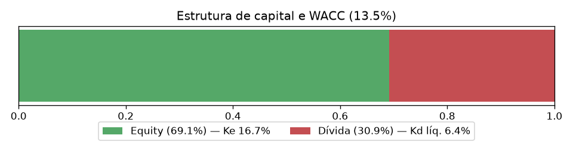
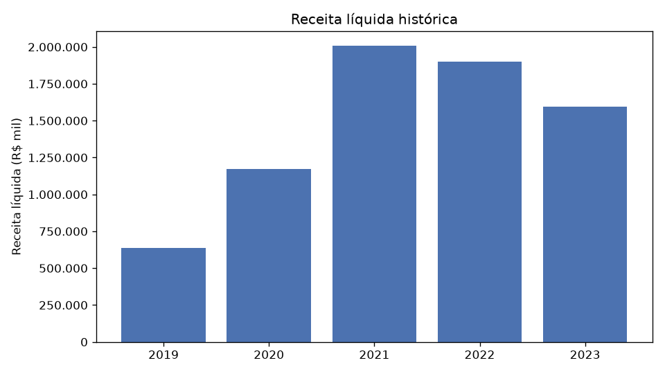
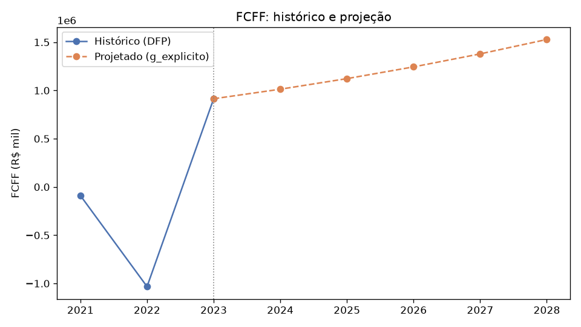
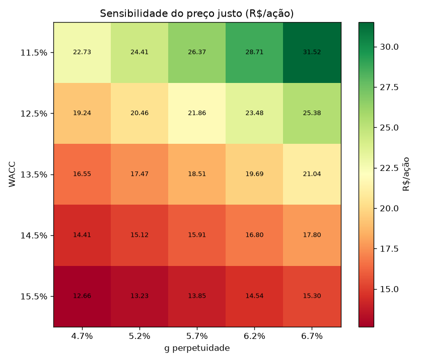
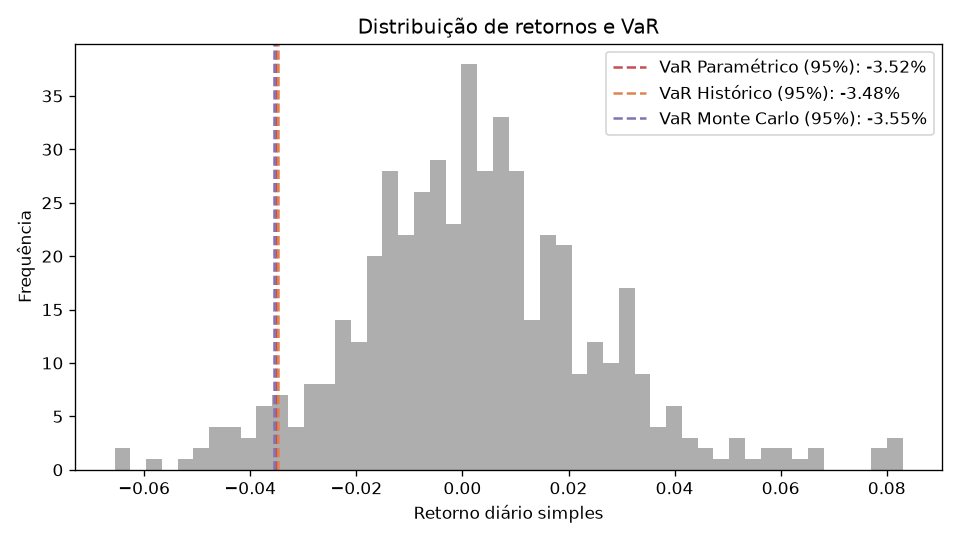

# Relatório de Valuation — JHSF3 (2023)

Gerado automaticamente por `scripts/gerar_relatorio.py`. Ver `README.md` para a metodologia completa e as premissas/limitações de cada etapa (documentadas como comentários em `src/`).

## 1. Custo de capital (WACC)

- Beta (10a vs. Ibovespa): **1.194** (R² = 0.33)
- Prêmio de risco de mercado: **2.37%**
- Rf (Selic anualizada): **13.90%**
- Ke (CAPM): **16.72%**
- Kd líquido de IR: **6.42%**
- **WACC: 13.54%**

## 2. Receita histórica

## 3. FCFF e DCF (Gordon Growth)

- FCFF base (2023): **R$ 913,758 mil**
- g explícito (CAGR receita, 3a): **10.83%**
- g perpetuidade (IPCA médio anualizado, 5a): **5.71%**
- Enterprise Value: **R$ 15,167,262 mil**
- Dívida líquida: **R$ 2,620,369 mil**
- Equity Value: **R$ 12,546,893 mil**

> O gráfico acima mostra o FCFF histórico completo, não só o ano-base: se ele foi negativo em algum dos anos recentes e só virou positivo no último ano (efeito comum de ΔNWC lumpy em incorporadoras), o DCF está projetando a partir de um único ano potencialmente anômalo — ver ressalva em `calcular_fcff` (src/dcf.py).

## 4. Preço justo vs. mercado

- **Preço justo (DCF): R$ 18.51**
- Preço de mercado atual: R$ 10.79
- Upside/downside implícito: **+71.5%**

> Premissas (`g_explicito`, `g_perpetuidade`) são um ponto de partida, não uma recomendação — ver ressalvas em `src/dcf.py` sobre sensibilidade da janela de CAGR escolhida.

## 5. Valor em Risco (VaR)

| Confiança | Paramétrico | Histórico | Monte Carlo |
|---|---|---|---|
| 95% | 3.52% | 3.48% | 3.55% |
| 99% | 5.08% | 4.81% | 5.12% |

VaR expresso como % do valor exposto, horizonte de 1 dia.